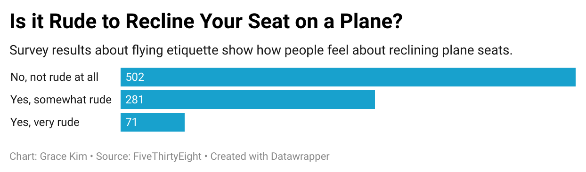

# J124-Flying-Etiquette

## *Reasoning*
I chose the question, "**Is it rude to recline your seat on a plane**?" because while it is a pretty simple and common question, I find myself being pretty sensitive about it. I'm the type of person who tends to get annoyed or irritated easily, especially at the smallest situations. I found this dataset interesting because a majority of the respondents said that reclining your seat on a plane wasn't rude at all which was surprising to me. Only 71 respondents said it was very rude etiquette, and I expected the results to be more split 50-50. I expected more people to have a stronger reaction to flying etiquette since it's a smaller space and can add to discomfort. 

The chart shows how many respondents selected among the responses **"No, not rude at all"**,
**"Yes, somewhat rude"**, and **"Yes, very rude"**. It revealed that a majority of respondents (~58%) thought reclining was fine. I was debating using a pie chart at first because I thought pie slices would be a straightforward visual to a general audience who tend to like those charts. However, upon further inspection, I noticed that compared to a bar chart, it was difficult to see the difference in responses easily. I decided that the arcs of a pie chart may be hindering visibility instead, and are probably better for percentages. I stuck with a horizontal bar chart because it was easier to see the raw values and see the differences side by side. In the pivot tables, I added a third column "percent of respondents" but ultimately decided it wasn't necessary for the graph. I felt that it might clutter the chart and confuse/mislead the audience and opted for just the raw numbers. 

### Bar Chart of Flying Etiquette Survey Results 

